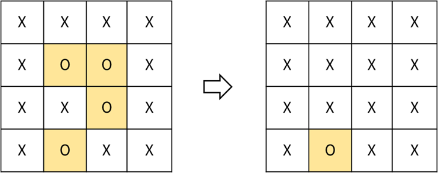

Practice
===

문제 설명
---

row x col 행렬 형태의 보드에 다음과 같이 X, O 로 표시가 되어 있다.

이 때 X 로 둘러쌓여있는 O 는 X로 변경하고,  
상하좌우 방향으로 O 에 연결되어 있는 O 는 그대로 O 로 유지한 후 출력하는 프로그램을 작성하세요.

참고) 외곽부에 닿아 있는 O 는 X 로 둘러쌓여있지 않은 것으로 본다.

입출력 예시
---
|입력|결과|
|---|---|
|X X X X   X O O X   X X O X   X O X X |X X X X   X X X X   X X X X   X O X X |
|X X X X   X O O X   X X O X   X O O X |X X X X   X O O X   X X O X   X O O X|

